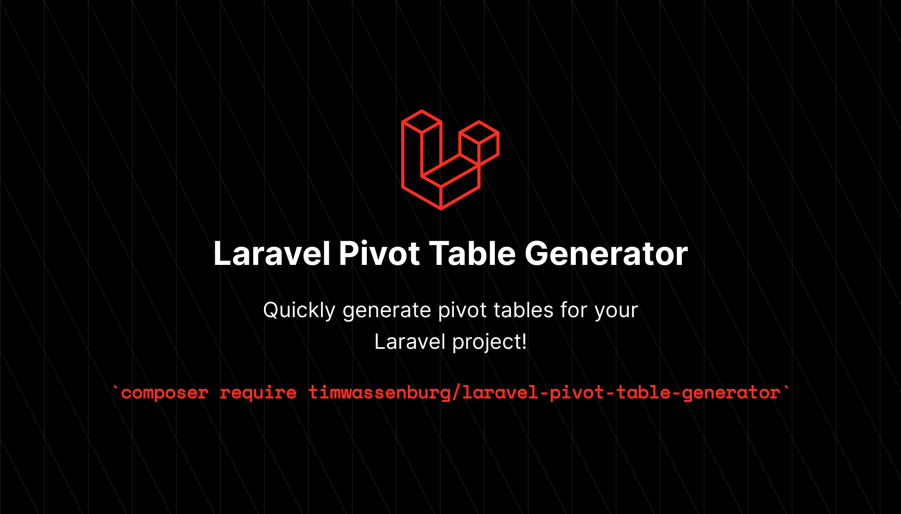

[](https://packagist.org/packages/timwassenburg/laravel-pivot-table-generator)
[](https://github.com/timwassenburg/laravel-pivot-table-generator/actions?query=workflow%3Arun-tests+branch%3Amaster)
[](https://packagist.org/packages/timwassenburg/laravel-pivot-table-generator)
[](https://packagist.org/packages/timwassenburg/laravel-pivot-table-generator)

<hr>

## Table of Contents
  <ol>
    <li><a href="#installation">Installation</a></li>
    <li>
      <a href="#usage">Usage</a>
    </li>
    <li><a href="#testing">Testing</a></li>
    <li><a href="#more-generator-packages">More generator packages</a></li>
    <li><a href="#contributing">Contributing</a></li>
    <li><a href="#license">License</a></li>
  </ol>

## Installation
Install the package with composer.
```bash
composer require timwassenburg/laravel-pivot-table-generator --dev
```

## Usage
Run the following command on the command-line to generate a new migration for the pivot table.
```bash
php artisan make:pivot {first_table_name} {second_table_name}
```

The command will create a new migration in ```database/migrations```. Run the migrations to create the table.
```bash
php artisan migrate
```

## Testing

Run the tests with:

```bash
composer test
```

## More generator packages

Looking for more ways to speed up your workflow? Make sure to check out these packages.

- [Laravel Action Generator](https://github.com/timwassenburg/laravel-action-generator)
- [Laravel Pivot Table Generator](https://github.com/timwassenburg/laravel-pivot-table-generator)
- [Laravel Repository Generator](https://github.com/timwassenburg/laravel-repository-generator)
- [Laravel Service Generator](https://github.com/timwassenburg/laravel-service-generator)
- [Laravel Trait Generator](https://github.com/timwassenburg/laravel-trait-generator)

The packages mentioned above are part of [Laravel Artisan Extender](https://github.com/timwassenburg/laravel-artisan-extender).

## Contributing
Contributions are what make the open source community such an amazing place to learn, inspire, and create. Any contributions you make are **greatly appreciated**.

If you have a suggestion that would make this better, please fork the repo and create a pull request. You can also simply open an issue with the tag "enhancement".
Don't forget to give the project a star! Thanks again!

1. Fork the Project
2. Create your Feature Branch (`git checkout -b feature/AmazingFeature`)
3. Commit your Changes (`git commit -m 'Add some AmazingFeature'`)
4. Push to the Branch (`git push origin feature/AmazingFeature`)
5. Open a Pull Request

## License

The MIT License (MIT). Please see [License File](LICENSE.md) for more information.
